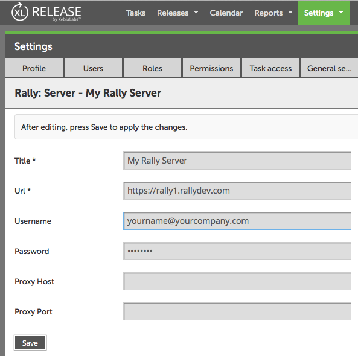
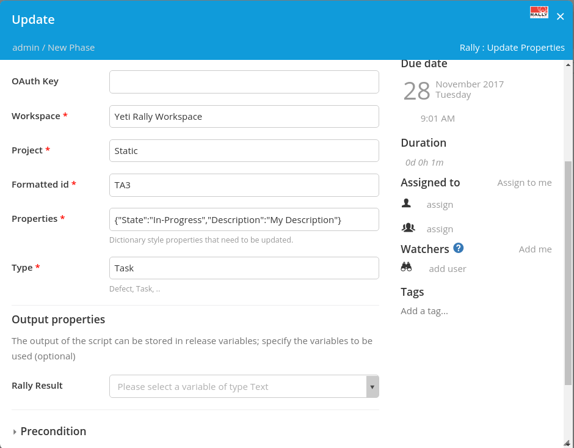
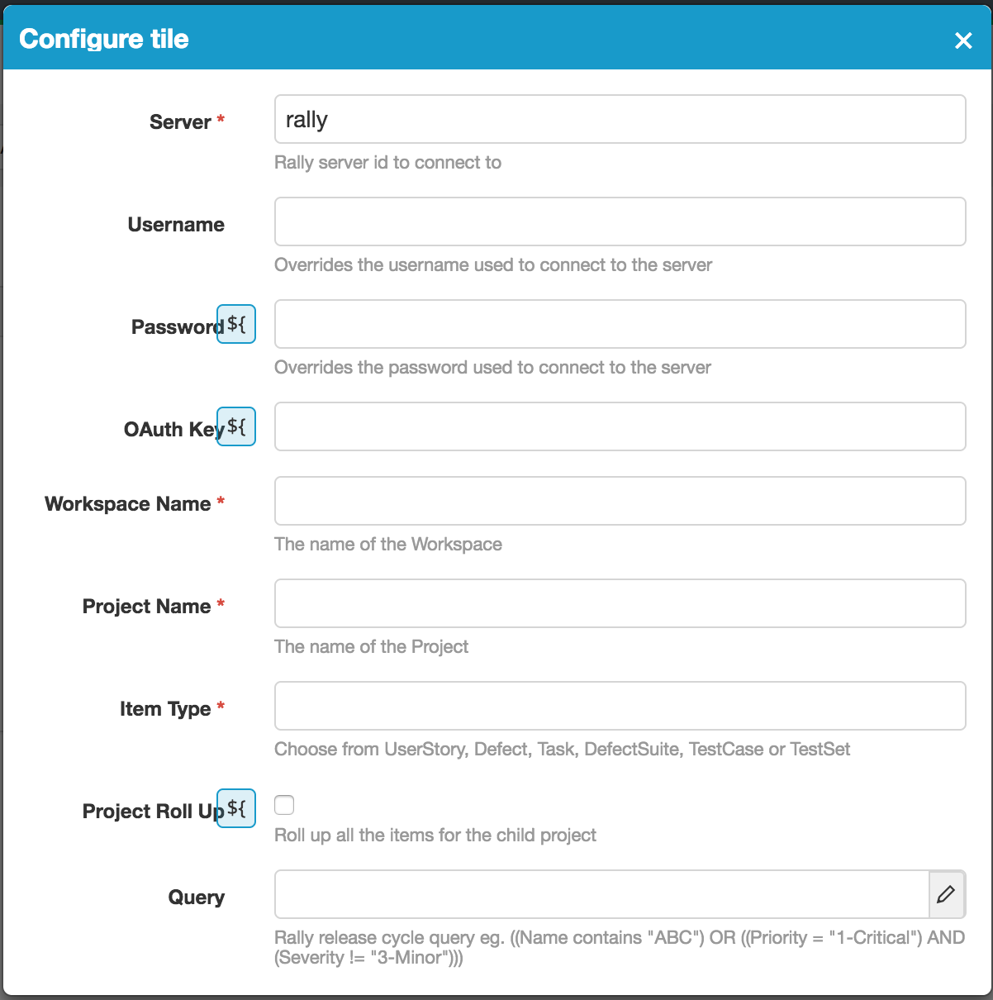
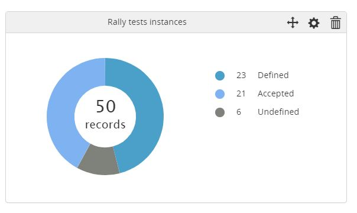

# XL Release Rally plugin #

## Preface ##

This document describes the functionality provided by the xlr-rally-plugin.

See the **[XL Release Documentation](https://docs.xebialabs.com/xl-release/index.html)** for background information on XL Release and release concepts.

[![Build Status][xlr-rally-travis-image] ][xlr-rally-travis-url]
[![Build Status][xlr-rally-codacy-image] ][xlr-rally-codacy-url]
[![Build Status][xlr-rally-code-climate-image] ][xlr-rally-code-climate-url]
[![License: MIT][xlr-rally-plugin-license-image]][xlr-rally-plugin-license-url]
![Github All Releases][xlr-rally-plugin-downloads-image]
[![xlrtdk][xlrtdk-image] ][xlrtdk-url]

[xlr-rally-travis-image]: https://travis-ci.org/xebialabs-community/xlr-rally-plugin.svg?branch=master
[xlr-rally-travis-url]: https://travis-ci.org/xebialabs-community/xlr-rally-plugin
[xlr-rally-codacy-image]: https://api.codacy.com/project/badge/Grade/b74aca3c5da7483193ceef88bc93ec44
[xlr-rally-codacy-url]: https://www.codacy.com/app/rvanstone/xlr-rally-plugin
[xlr-rally-code-climate-image]: https://codeclimate.com/github/xebialabs-community/xlr-rally-plugin/badges/gpa.svg
[xlr-rally-code-climate-url]: https://codeclimate.com/github/xebialabs-community/xlr-rally-plugin
[xlr-rally-plugin-license-image]: https://img.shields.io/badge/License-MIT-yellow.svg
[xlr-rally-plugin-license-url]: https://opensource.org/licenses/MIT
[xlr-rally-plugin-downloads-image]: https://img.shields.io/github/downloads/xebialabs-community/xlr-rally-plugin/total.svg
[xlrtdk-image]: https://img.shields.io/badge/xlrelease-tdk-brightgreen.svg
[xlrtdk-url]: https://docs.xebialabs.com/xl-release/concept/versioned/tdk-api-readme.html

## Overview ##

The xlr-rally-plugin is a XL Release plugin that allows to integrate XL Release with Rally.

## Requirements ##

* **Requirements**
	* **XL Release** 6.0+
* **Remark**
    * Version 3.x is based on [pyral](http://pythonhosted.org/pyral/overview.html). As such it doesn't require any additional jars.
      However it will require some changes compared to 2.x (Different `URI` for the Shared Configuration and also requires to define the `project`)
    * Version 2.x is not backwards compatible with version 1.x. This means you'll have to reconfigure some tasks.

## Installation ##

* Place the plugin [JAR](https://github.com/xebialabs-community/xlr-rally-plugin/releases) file into your `SERVER_HOME/plugins` directory.
* Restart the server  

## Types ##

+ CreateDefect
+ CreateTask
+ UpdateProperties
+ CreateUserStory
+ UpdateOwner
+ UpdateScheduleState
+ UpdateParent

## Usage ##

First, you need to add an entry in the [Configuration](https://docs.xebialabs.com/xl-release/how-to/create-custom-configuration-types-in-xl-release.html#configuration-page) section with information on how to connect to your Rally instance:

For `URI`, make sure to use something like `rally1.rallydev.com` (without `http` or `https`)

The next step is to add the required task [Types](#Types) to your release template, for example:

Note, properties are defined in the following format

`{ "property1Name" : "property1Value","property2Name" : "property2Value" }`

In the example above the Task TA3 has been updated with a new description and it's state has been progressed.

### Rally object reference ###
##### Defect #####
* code: DE
* default state progression: Submitted, Open, Fixed, Closed

##### Defect Suite #####
* code: DS

##### Iteration #####
* default state progression: Planning, Committed, Accepted 

##### Task #####
* code: TA
* default state progression: Defined, In-Progress, Completed

##### Test Case
* code: TC 

##### User Story #####
* code: US

### Rally Tile ###
This tile can be used to capture rally records based on a query

#### Tile Configuration ####

#### Tile Preview ####

